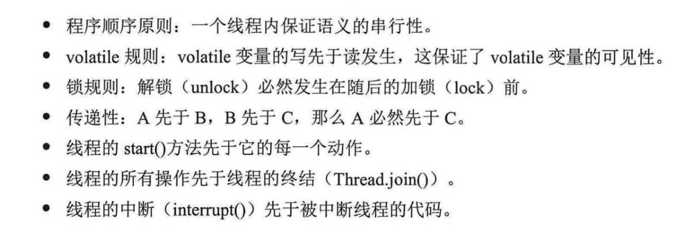

#学习
## 高速缓存
### 缓存一致性协议
当cpu写入数据的时候，如果发现改变了被共享（即其他cpu中存在其副本），会发出一个信号，通知其他的cpu该变量的缓存无效<br>
当其他cpu进行读取时，回去主存进行读取<br>
这个有点类似 redis中的缓存，更新（泛指）操作，应该要对缓存进行失效处理
### LOCK#
### 并发三个特性
- 1.原子性
i++
要么全部成功要么全部失败
- 2.可见性

|thread-1 | thread-2|   
| ------ | ------ |
|int i = 0; | int j = i;|
|i = 10; |     |
|cache （(i = 10)） | cache (j = 0 maybe)|
|i = 10 | j = 10|
- 3.有序性
指令重排序
```java
int i = 0;
i = 1;
boolean flag = false;
flag = true;
```
### java中如何保证三个属性
1.原子性<br>
对基本类型的变量和读取和赋值都保证了原子性<br>
i = 10 <br>
cache 10 memory = 10 <br>

a = 10 原子性 <br>
b = a 不满足 1.read a 2.assign b <br>
c++ 不满足 1.read c 2.add 3.assign to c <br>
c = c + 1 1.read c 2.add 3.assign to c <br>

2.可见性<br>
volatile 可以保证可见性 变化会立即刷新到主存中
加锁

3.有序性（最终一致性）<br>
happens-before relationship
代码执行顺序 一个线程内程序保证串行性
unlock操作 必须要 在 lock后面<br>
volatile修饰的变量 对变量的读操作必须在变量的写操作之后<br>
传递规则 a先于b b先于c 那么a比先于c<br>
线程启动 start 必须优先于run<br>
线程中断 interrupt必须要在捕获该InterruptException之前<br>
对象销毁 初始化必须在finalize之前<br>
线程终结 所有的操作都在线程死亡之前<br>



